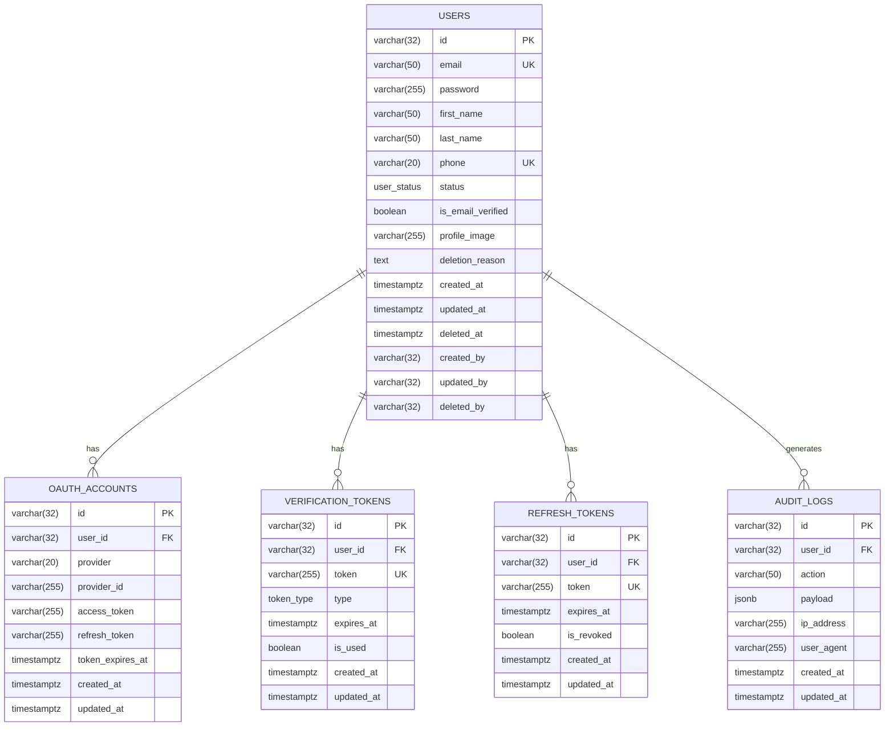

# Authentication System ERD

## ERD Diagram

#### ERD를 보기위해 mermaid plugin 설치 필요




Enum 타입 생성
```sql
CREATE TYPE user_status AS ENUM ('ACTIVE', 'INACTIVE', 'DELETED');
CREATE TYPE token_type AS ENUM ('EMAIL_VERIFICATION', 'PASSWORD_RESET');
CREATE TYPE audit_action AS ENUM (
'USER_CREATED',
'USER_UPDATED',
'USER_DELETED',
'PASSWORD_CHANGED',
'LOGIN_SUCCESS',
'LOGIN_FAILED',
'LOGOUT',
'EMAIL_VERIFIED',
'PASSWORD_RESET_REQUESTED',
'OAUTH_LINKED',
'OAUTH_UNLINKED'
);
```

Users 테이블
```sql
CREATE TABLE users (
id varchar(32) NOT NULL PRIMARY KEY,
email varchar(50) NOT NULL,
password varchar(255) NOT NULL,
first_name varchar(50) NOT NULL,
last_name varchar(50) NOT NULL,
phone varchar(20),
status user_status NOT NULL DEFAULT 'ACTIVE',
is_email_verified boolean NOT NULL DEFAULT FALSE,
profile_image varchar(255),
deletion_reason text,
created_at timestamptz NOT NULL DEFAULT CURRENT_TIMESTAMP,
updated_at timestamptz NOT NULL DEFAULT CURRENT_TIMESTAMP,
deleted_at timestamptz,
CONSTRAINT uq_users_email UNIQUE(email),
CONSTRAINT uq_users_phone UNIQUE(phone)
);
```

OAuth Accounts 테이블
```sql
CREATE TABLE oauth_accounts (
id varchar(32) NOT NULL PRIMARY KEY,
user_id varchar(32) NOT NULL,
provider varchar(20) NOT NULL,
provider_id varchar(255) NOT NULL,
access_token varchar(255) NOT NULL,
refresh_token varchar(255),
token_expires_at timestamptz NOT NULL,
created_at timestamptz NOT NULL DEFAULT CURRENT_TIMESTAMP,
updated_at timestamptz NOT NULL DEFAULT CURRENT_TIMESTAMP,
CONSTRAINT fk_oauth_user FOREIGN KEY (user_id) REFERENCES users(id),
CONSTRAINT uq_oauth_user_provider UNIQUE(user_id, provider),
CONSTRAINT uq_oauth_provider_id UNIQUE(provider, provider_id)
);
```

Verification Tokens 테이블
```sql
CREATE TABLE verification_tokens (
id varchar(32) NOT NULL PRIMARY KEY,
user_id varchar(32),
token varchar(255) NOT NULL,
type token_type NOT NULL,
expires_at timestamptz NOT NULL,
is_used boolean NOT NULL DEFAULT FALSE,
created_at timestamptz NOT NULL DEFAULT CURRENT_TIMESTAMP,
updated_at timestamptz NOT NULL DEFAULT CURRENT_TIMESTAMP,
CONSTRAINT fk_verification_user FOREIGN KEY (user_id) REFERENCES users(id),
CONSTRAINT uq_verification_token UNIQUE(token)
);
```

Refresh Tokens 테이블
```sql
CREATE TABLE refresh_tokens (
id varchar(32) NOT NULL PRIMARY KEY,
user_id varchar(32) NOT NULL,
token varchar(255) NOT NULL,
expires_at timestamptz NOT NULL,
is_revoked boolean NOT NULL DEFAULT FALSE,
created_at timestamptz NOT NULL DEFAULT CURRENT_TIMESTAMP,
updated_at timestamptz NOT NULL DEFAULT CURRENT_TIMESTAMP,
CONSTRAINT fk_refresh_user FOREIGN KEY (user_id) REFERENCES users(id),
CONSTRAINT uq_refresh_token UNIQUE(token)
);
```

Audit Logs 테이블
```sql
CREATE TABLE audit_logs (
id varchar(32) NOT NULL PRIMARY KEY,
user_id varchar(32),
action varchar(50) NOT NULL,
payload jsonb,
ip_address varchar(255),
user_agent varchar(255),
created_at timestamptz NOT NULL DEFAULT CURRENT_TIMESTAMP,
updated_at timestamptz NOT NULL DEFAULT CURRENT_TIMESTAMP,
CONSTRAINT fk_audit_user FOREIGN KEY (user_id) REFERENCES users(id)
);
```
